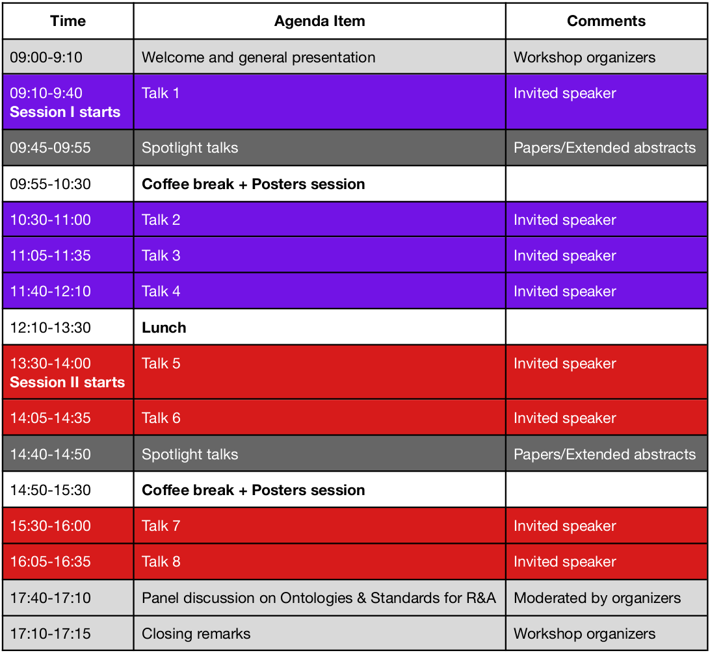

**Location:** Pacific Convention Plaza, Yokohama, Japan

**Invited speakers for Session I**

- **[Talk 1] *What is causation?***, by Riichiro Mizoguchi, Japan Advanced Institute of Science and Technology, Japan
- **[Talk 2] *Working Towards Standardized Robotic Task Planning: An Applications Guide (IEEE RAS 1872.1.1***, by Stephen Balakirsky, Georgia Tech Research Institute (GTRI), USA 
- **[Talk 3] *Shaping Cognitive Control through Ontology-based Reasoning***, by Alessandro Umbrico, Institute of Cognitive Sciences and Technologies (ISTC-CNR), Italy
- **[Talk 4] *IEEE standard development and awards***, by Howard Li, University of New Brunswick, New Brunswick, Canada 

**Invited speakers for Session II**

- **[Talk 5] *Title to be decided***, by Michael Beetz, Institute for Artificial Intelligence, University of Bremen, Germany 
- **[Talk 6] *Robotic Service Ontology (RoSO): Standardization Activities in Object Management Group***, by Koji Kamei, NTT Communication Science Laboratories, Japan 
- **[Talk 7] *Metrics and Standards for Human Robot Interaction and Collaborative Robotics***, by Megan Zimmerman, National Institute of Standards and Technology (NIST), USA
- **[Talk 8] *Bridging the AI Application Gap in Industrial Robotics with Ontologies and Standards***, by Benjamin Alt, Artiminds, Germany 

**Tentative agenda**

Note that time is in the local time zone (Japan). 

 

